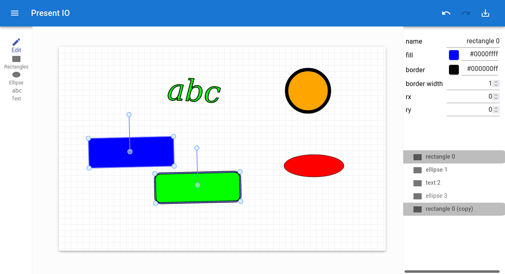

# Present IO


An online SVG editor with animation support for the purpose of presentations.



Try the live demo on [lochbrunner.github.io/present.io](https://lochbrunner.github.io/present.io)

## Setup

```bash
yarn install
```

## Build

```bash
yarn build
```

## Usage

### Move Canvas

Press `Alt` key and drag with the mouse.
Use your mouse wheel to zoom in and out.

### Snap to Grid

Keep the `Ctrl` pressed while editing.

### Creating Objects

Press `Escape` to abort the current object creation.

#### Polygon

Press `Enter` to finish the polygon.

### Editing Vertices

Select a polygon or line object and switch to the *Vertex Edit Mode* (hotkey: `v`).
You can move the vertices.
With `Shift` key pressed you can delete a vertex by clicking on it.
To add a new vertex press `Ctrl` key while clicking on a existing vertex. This will create a new vertex after that one. 